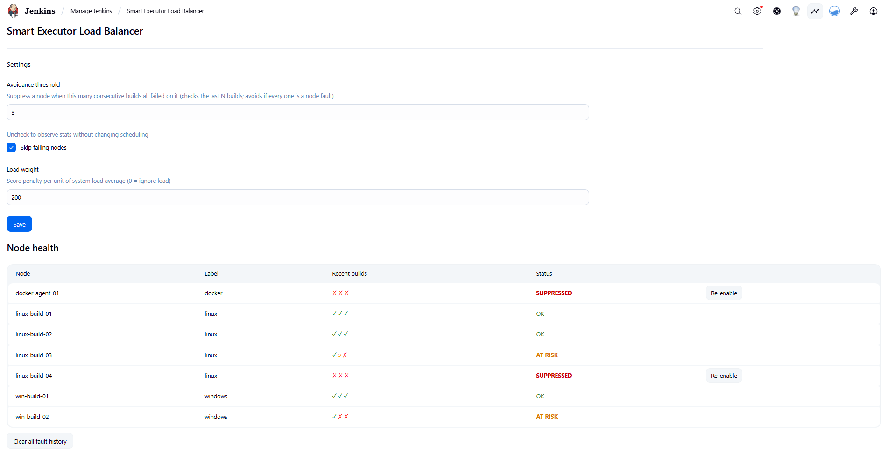

# Smart Executor Load Balancer Plugin

[](https://github.com/ravisalamani/smart-executor-load-balancer-plugin/actions/workflows/ci.yml)

A Jenkins plugin that routes builds to the freest available node and automatically
avoids nodes with repeated environment failures.



## What it does

Jenkins' default scheduler picks nodes by label match without considering how
busy or how healthy a node is. This plugin replaces that scheduler with one that:

1. **Prefers idle nodes** — scores each candidate node by its idle vs. busy
   executor count, so builds spread across your fleet rather than piling up on one node.

2. **Accounts for system load** — the 1-minute load average is included in the
   score so a node that is CPU-saturated is deprioritised even if it has free executors.

3. **Tracks per-(node, label) fault history** — every build completion is recorded in
   a rolling window keyed by the node it ran on and the label that was requested.
   Only node-environment faults (channel crashes, OOMs, agent timeouts) count as
   true faults. A build that exits with a non-zero code (`exit 1`) is recorded
   separately as a code fault and does not trigger suppression.

4. **Suppresses repeatedly-failing nodes** — when the last *N* builds on a
   (node, label) pair are all node-environment faults, that node is skipped for
   future builds carrying that label.  If every candidate is suppressed, the
   balancer falls back to the full pool so builds never get permanently stuck.

5. **Gives admins manual control** — a management page at
   **Manage Jenkins → Smart Executor Load Balancer** shows every node's fault
   history with a sparkline, status (OK / AT RISK / SUPPRESSED), a per-node
   Re-enable button, and a global clear button.

## Installation

### From a GitHub Release (no build required)

1. Download `smart-executor-load-balancer.hpi` from the
   [latest release](https://github.com/ravisalamani/smart-executor-load-balancer-plugin/releases).
2. In Jenkins: **Manage Jenkins → Plugins → Advanced → Deploy Plugin**.
3. Upload the `.hpi` file and restart Jenkins.

### Building from source

Requires JDK 11+ and Maven 3.8+.

```bash
git clone https://github.com/ravisalamani/smart-executor-load-balancer-plugin.git
cd smart-executor-load-balancer-plugin
mvn clean package -DskipTests
# .hpi is at target/smart-executor-load-balancer.hpi
```

## Configuration

Go to **Manage Jenkins → Smart Executor Load Balancer**.

| Setting | Default | Description |
|---|---|---|
| **History window** | `3` | How many recent builds to look at per (node, label) pair. A node is suppressed when ALL of the last N builds were node-environment faults. |
| **Skip failing nodes** | disabled | Enable to activate node suppression. Fault history is always recorded regardless, so you can observe the health table before turning this on. |
| **Load weight** | `200` | Multiplier applied to the node's 1-minute load average when computing the score. Set to 0 to disable load-aware routing. |

## Per-job opt-out

On any job's configuration page, under **Smart Executor Load Balancer**, tick
**Disable Smart Executor Load Balancer for this job** to use Jenkins' default
scheduler for that job only. Useful for jobs pinned to a specific node.

## How suppression works

Each build on a JNLP/SSH node records one entry in a rolling window:

- `NODE_FAULT` — agent channel crash, OutOfMemoryError, connection timeout
- `TIMEOUT` — build timed out at the executor level
- `CODE_FAULT` — build exited with a non-zero code (script failure, test failure, etc.)
- `NONE` — successful build

A node is suppressed for a given label when the most recent *N* entries
(where *N* = History window) are all `NODE_FAULT` or `TIMEOUT`. `CODE_FAULT`
entries do not count toward suppression because the node itself is healthy —
the problem is in the build script.

When a suppressed node is the *only* candidate for a label, the balancer
falls back to the full pool and logs a warning. This prevents builds from
queuing indefinitely.

To re-enable a suppressed node, click **Re-enable** next to it on the
management page, or click **Clear all fault history** to reset everything.

## Scoring formula

```
score = (idleExecutors  × 1,000)
      − (busyExecutors  × 10,000)
      − (systemLoad     × loadWeight)
      − (nodeFaultCount × 2,000)
```

The highest-scoring non-suppressed node wins. Ties are broken by order of
iteration (effectively random).

## Compatibility

- Jenkins 2.479.1 LTS or later
- Java 11 or later
- Works with freestyle, pipeline (`agent { label '...' }`), and matrix projects
- No dependency on other plugins

## License

[MIT](LICENSE)
